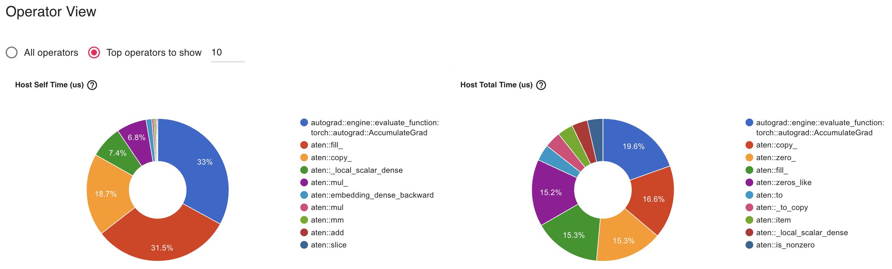

# Overview

This repository is for profiling and analyzing DeepSpeed. 
Copied from [v0.14.0 DeepSpeed](https://github.com/microsoft/DeepSpeed/tree/v0.14.0) and some features (MoE, and so on) and directories are removed for simplicity.


# Install

```
# create new venv
VENV_DIR=/path/to/dir/venv
pip install virtualenv
python -m virtualenv -p python3 $VENV_DIR/ds_study
source $VENV_DIR/ds_study/bin/activate
```

```
# remove existing deepspeed and do editable install
ROOT_DIR=/path/to/dir/deepspeed_profiling
cd $ROOT_DIR/pruned_deepspeed/DeepSpeed &&\
pip uninstall deepspeed -y &&\
pip install -e . &&\
cd .. 
```

(please see [requirements.txt](./DeepSpeed/requirements/requirements.txt) for explicit version)

```
cd $ROOT_DIR/pruned_deepspeed/multiprocessing_pdb &&\
pip install -e . &&\
cd ..
```

- for profiling HF mistral class, you should install `transformers` and `accelerate` 


# Check dependencies

```
python -c "import deepspeed; print(deepspeed); print(deepspeed.__version__); \
import torch; print(torch.__version__); print(torch.cuda.nccl.version()); \
import transformers; print(transformers.__version__); \
import accelerate; print(accelerate.__version__);"
```

```python
[2024-03-25 10:25:16,986] [INFO] [real_accelerator.py:203:get_accelerator] Setting ds_accelerator to cuda (auto detect)
[2024-03-25 10:25:17,113] [INFO] [real_accelerator.py:203:get_accelerator] Setting ds_accelerator to cuda (auto detect)
 [WARNING]  async_io requires the dev libaio .so object and headers but these were not found.
 [WARNING]  async_io: please install the libaio-dev package with apt
 [WARNING]  If libaio is already installed (perhaps from source), try setting the CFLAGS and LDFLAGS environment variables to where it can be found.
 [WARNING]  Please specify the CUTLASS repo directory as environment variable $CUTLASS_PATH
 [WARNING]  sparse_attn requires a torch version >= 1.5 and < 2.0 but detected 2.2
 [WARNING]  using untested triton version (2.2.0), only 1.0.0 is known to be compatible
<module 'deepspeed' from '/path/to/dir/deepspeed_profiling/pruned_deepspeed/DeepSpeed/deepspeed/__init__.py'>
0.14.1+e576958
2.2.1+cu118
(2, 19, 3)
4.38.0
0.26.0
```


# Target files

- body
    - [deepspeed.initialize](./DeepSpeed/deepspeed/__init__.py)
    - [runtime/engine.py](./DeepSpeed/deepspeed/runtime/engine.py)
    - [runtime/utils.py](./DeepSpeed/deepspeed/runtime/utils.py)
    - [utils/group.py](./DeepSpeed/deepspeed/utils/groups.py)
    - [accelerator/cuda_accelerator.py](./DeepSpeed/deepspeed/accelerator/cuda_accelerator.py)
    
- core (ZeRO related)
    - [zero/stage_1_and_2.py](./DeepSpeed/deepspeed/runtime/zero/stage_1_and_2.py)
    - [zero/stage3.py](./DeepSpeed/deepspeed/runtime/zero/stage3.py)
        - [zero/partition_parameters.py](./DeepSpeed/deepspeed/runtime/zero/partition_parameters.py)
    - [zero/parameter_offload.py](./DeepSpeed/deepspeed/runtime/zero/parameter_offload.py)
    - [zero/utils.py](./DeepSpeed/deepspeed/runtime/zero/utils.py)
    - [fp16/loss_scaler](./DeepSpeed/deepspeed/runtime/fp16/loss_scaler.py)


# Run script

## my setting

```cpp
+-----------------------------------------------------------------------------+
| NVIDIA-SMI 470.82.01    Driver Version: 470.82.01    CUDA Version: 11.4     |
|-------------------------------+----------------------+----------------------+
| GPU  Name        Persistence-M| Bus-Id        Disp.A | Volatile Uncorr. ECC |
| Fan  Temp  Perf  Pwr:Usage/Cap|         Memory-Usage | GPU-Util  Compute M. |
|                               |                      |               MIG M. |
|===============================+======================+======================|
|   0  NVIDIA A100-SXM...  On   | 00000000:8A:00.0 Off |                  Off |
| N/A   27C    P0    62W / 400W |      0MiB / 81251MiB |      0%      Default |
|                               |                      |             Disabled |
+-------------------------------+----------------------+----------------------+
|   1  NVIDIA A100-SXM...  On   | 00000000:8F:00.0 Off |                  Off |
| N/A   27C    P0    61W / 400W |      0MiB / 81251MiB |      0%      Default |
|                               |                      |             Disabled |
+-------------------------------+----------------------+----------------------+
```


## zero-1 with dummy MLP model

```
deepspeed run.py \
--stage=1 \
--precision="bf16"
```

<details>

```
raise NotImplementedError
```

<details>


## zero-2 with dummy MLP model

```
deepspeed run.py \
--stage=2 \
--precision="bf16"
```

```
deepspeed run.py \
--stage=2 \
--precision="bf16" \
--offload="cpu"
```

<details>

```python
[2024-03-20 16:22:18,301] [INFO] [utils.py:800:see_memory_usage] DeepSpeed Engine: Before configure distributed model
[2024-03-20 16:22:18,302] [INFO] [utils.py:801:see_memory_usage] MA 0.0 GB         Max_MA 0.0 GB         CA 0.0 GB         Max_CA 0 GB
[2024-03-20 16:22:18,302] [INFO] [utils.py:808:see_memory_usage] CPU Virtual Memory:  used = 65.5 GB, percent = 3.2%
[2024-03-20 16:22:19,004] [INFO] [utils.py:800:see_memory_usage] DeepSpeed Engine: After configure distributed model
[2024-03-20 16:22:19,005] [INFO] [utils.py:801:see_memory_usage] MA 0.02 GB         Max_MA 0.02 GB         CA 0.02 GB         Max_CA 0 GB
[2024-03-20 16:22:19,005] [INFO] [utils.py:808:see_memory_usage] CPU Virtual Memory:  used = 65.82 GB, percent = 3.3%
```

```python
[2024-03-20 16:22:19,005] [INFO] [logging.py:96:log_dist] [Rank 0] Using client Optimizer as basic optimizer
[2024-03-20 16:22:19,006] [INFO] [logging.py:96:log_dist] [Rank 0] Removing param_group that has no 'params' in the basic Optimizer
[2024-03-20 16:22:19,006] [INFO] [logging.py:96:log_dist] [Rank 0] DeepSpeed Basic Optimizer = DeepSpeedCPUAdam
[2024-03-20 16:22:19,006] [INFO] [utils.py:56:is_zero_supported_optimizer] Checking ZeRO support for optimizer=DeepSpeedCPUAdam type=<class 'deepspeed.ops.adam.cpu_adam.DeepSpeedCPUAdam'>
[2024-03-20 16:22:19,006] [INFO] [logging.py:96:log_dist] [Rank 0] Creating torch.bfloat16 ZeRO stage 2 optimizer
[2024-03-20 16:22:19,006] [INFO] [stage_1_and_2.py:107:__init__] Reduce bucket size 500000000
[2024-03-20 16:22:19,006] [INFO] [stage_1_and_2.py:108:__init__] Allgather bucket size 500000000
[2024-03-20 16:22:19,006] [INFO] [stage_1_and_2.py:109:__init__] CPU Offload: True
[2024-03-20 16:22:19,006] [INFO] [stage_1_and_2.py:110:__init__] Round robin gradient partitioning: False
[2024-03-20 16:22:19,110] [INFO] [utils.py:800:see_memory_usage] Before initializing optimizer states
[2024-03-20 16:22:19,111] [INFO] [utils.py:801:see_memory_usage] MA 0.02 GB         Max_MA 0.02 GB         CA 0.04 GB         Max_CA 0 GB
[2024-03-20 16:22:19,111] [INFO] [utils.py:808:see_memory_usage] CPU Virtual Memory:  used = 65.84 GB, percent = 3.3%
[2024-03-20 16:22:19,183] [INFO] [utils.py:800:see_memory_usage] After initializing optimizer states
[2024-03-20 16:22:19,183] [INFO] [utils.py:801:see_memory_usage] MA 0.02 GB         Max_MA 0.02 GB         CA 0.04 GB         Max_CA 0 GB
[2024-03-20 16:22:19,183] [INFO] [utils.py:808:see_memory_usage] CPU Virtual Memory:  used = 65.85 GB, percent = 3.3%
[2024-03-20 16:22:19,183] [INFO] [stage_1_and_2.py:493:__init__] optimizer state initialized
[2024-03-20 16:22:19,256] [INFO] [utils.py:800:see_memory_usage] After initializing ZeRO optimizer
[2024-03-20 16:22:19,257] [INFO] [utils.py:801:see_memory_usage] MA 0.02 GB         Max_MA 0.02 GB         CA 0.04 GB         Max_CA 0 GB
[2024-03-20 16:22:19,257] [INFO] [utils.py:808:see_memory_usage] CPU Virtual Memory:  used = 65.85 GB, percent = 3.3%
[2024-03-20 16:22:19,257] [INFO] [logging.py:96:log_dist] [Rank 0] DeepSpeed Final Optimizer = DeepSpeedCPUAdam
[2024-03-20 16:22:19,257] [INFO] [logging.py:96:log_dist] [Rank 0] DeepSpeed using client LR scheduler
[2024-03-20 16:22:19,258] [INFO] [logging.py:96:log_dist] [Rank 0] DeepSpeed LR Scheduler = None
[2024-03-20 16:22:19,258] [INFO] [logging.py:96:log_dist] [Rank 0] step=0, skipped=0, lr=[0.001], mom=[(0.9, 0.95)]
```

```python
[2024-03-20 16:22:19,337] [INFO] [utils.py:800:see_memory_usage] Engine before forward
[2024-03-20 16:22:19,337] [INFO] [utils.py:801:see_memory_usage] MA 0.02 GB         Max_MA 0.02 GB         CA 0.04 GB         Max_CA 0 GB
[2024-03-20 16:22:19,338] [INFO] [utils.py:808:see_memory_usage] CPU Virtual Memory:  used = 65.85 GB, percent = 3.3%
[2024-03-20 16:22:19,420] [INFO] [utils.py:800:see_memory_usage] Engine after forward
[2024-03-20 16:22:19,421] [INFO] [utils.py:801:see_memory_usage] MA 0.28 GB         Max_MA 0.28 GB         CA 0.29 GB         Max_CA 0 GB
[2024-03-20 16:22:19,421] [INFO] [utils.py:808:see_memory_usage] CPU Virtual Memory:  used = 65.86 GB, percent = 3.3%
```

```python
[2024-03-20 16:22:19,501] [INFO] [utils.py:800:see_memory_usage] Engine before backward
[2024-03-20 16:22:19,502] [INFO] [utils.py:801:see_memory_usage] MA 0.77 GB         Max_MA 1.25 GB         CA 1.51 GB         Max_CA 2 GB
[2024-03-20 16:22:19,502] [INFO] [utils.py:808:see_memory_usage] CPU Virtual Memory:  used = 65.86 GB, percent = 3.3%
[2024-03-20 16:22:19,610] [INFO] [utils.py:800:see_memory_usage] Engine after backward
[2024-03-20 16:22:19,611] [INFO] [utils.py:801:see_memory_usage] MA 0.29 GB         Max_MA 2.67 GB         CA 2.93 GB         Max_CA 3 GB
[2024-03-20 16:22:19,611] [INFO] [utils.py:808:see_memory_usage] CPU Virtual Memory:  used = 65.88 GB, percent = 3.3%
```

```python
[2024-03-20 16:22:19,681] [INFO] [utils.py:800:see_memory_usage] Engine before step
[2024-03-20 16:22:19,682] [INFO] [utils.py:801:see_memory_usage] MA 0.29 GB         Max_MA 0.29 GB         CA 2.93 GB         Max_CA 3 GB
[2024-03-20 16:22:19,682] [INFO] [utils.py:808:see_memory_usage] CPU Virtual Memory:  used = 65.88 GB, percent = 3.3%
[2024-03-20 16:22:19,752] [INFO] [utils.py:800:see_memory_usage] Engine after step
[2024-03-20 16:22:19,752] [INFO] [utils.py:801:see_memory_usage] MA 0.29 GB         Max_MA 0.29 GB         CA 2.93 GB         Max_CA 3 GB
[2024-03-20 16:22:19,753] [INFO] [utils.py:808:see_memory_usage] CPU Virtual Memory:  used = 65.88 GB, percent = 3.3%
```

```python
[2024-03-20 16:22:19,683] [INFO] [logging.py:96:log_dist] [Rank 0] time (ms) | fwd_microstep: 5.54 | bwd_microstep: 22.35 | bwd_inner_microstep: 7.10 | bwd_allreduce_microstep: 15.16 | step_microstep: 0.06
```

</details>


## zero-2 with HF mistral 7B

If you want to use built-in flash attention for llama like models (mistral or something), it should be ensured `torch>=2.1.1` to be installed because there is non deterministic issue for torch SDPA in lower version. 

```
# for those who have lower CUDA version
pip uninstall torch -y &&\
pip install torch --index-url https://download.pytorch.org/whl/cu118
```

```
deepspeed run.py \
--stage=2 \
--precision="bf16" \
--offload="cpu" \
--use_hf_model
```

- `w/o torch SDPA`

<details>

```python
[2024-03-20 16:16:02,339] [INFO] [utils.py:800:see_memory_usage] DeepSpeed Engine: After configure distributed model
[2024-03-20 16:16:02,340] [INFO] [utils.py:801:see_memory_usage] MA 13.99 GB         Max_MA 13.99 GB         CA 14.24 GB         Max_CA 14 GB
[2024-03-20 16:16:02,340] [INFO] [utils.py:808:see_memory_usage] CPU Virtual Memory:  used = 68.78 GB, percent = 3.4%
```

```python
[2024-03-20 16:16:02,342] [INFO] [logging.py:96:log_dist] [Rank 0] Using client Optimizer as basic optimizer
[2024-03-20 16:16:02,342] [INFO] [logging.py:96:log_dist] [Rank 0] Removing param_group that has no 'params' in the basic Optimizer
[2024-03-20 16:16:02,354] [INFO] [logging.py:96:log_dist] [Rank 0] DeepSpeed Basic Optimizer = DeepSpeedCPUAdam
[2024-03-20 16:16:02,354] [INFO] [utils.py:56:is_zero_supported_optimizer] Checking ZeRO support for optimizer=DeepSpeedCPUAdam type=<class 'deepspeed.ops.adam.cpu_adam.DeepSpeedCPUAdam'>
[2024-03-20 16:16:02,354] [INFO] [logging.py:96:log_dist] [Rank 0] Creating torch.bfloat16 ZeRO stage 2 optimizer
[2024-03-20 16:16:02,355] [INFO] [stage_1_and_2.py:107:__init__] Reduce bucket size 500000000
[2024-03-20 16:16:02,355] [INFO] [stage_1_and_2.py:108:__init__] Allgather bucket size 500000000
[2024-03-20 16:16:02,355] [INFO] [stage_1_and_2.py:109:__init__] CPU Offload: True
[2024-03-20 16:16:02,355] [INFO] [stage_1_and_2.py:110:__init__] Round robin gradient partitioning: False
[2024-03-20 16:16:28,844] [INFO] [utils.py:800:see_memory_usage] Before initializing optimizer states
[2024-03-20 16:16:28,845] [INFO] [utils.py:801:see_memory_usage] MA 14.23 GB         Max_MA 14.23 GB         CA 14.36 GB         Max_CA 14 GB
[2024-03-20 16:16:28,845] [INFO] [utils.py:808:see_memory_usage] CPU Virtual Memory:  used = 88.94 GB, percent = 4.4%
[2024-03-20 16:16:37,943] [INFO] [utils.py:800:see_memory_usage] After initializing optimizer states
[2024-03-20 16:16:37,943] [INFO] [utils.py:801:see_memory_usage] MA 14.23 GB         Max_MA 14.23 GB         CA 14.36 GB         Max_CA 14 GB
[2024-03-20 16:16:37,943] [INFO] [utils.py:808:see_memory_usage] CPU Virtual Memory:  used = 139.65 GB, percent = 6.9%
[2024-03-20 16:16:37,943] [INFO] [stage_1_and_2.py:493:__init__] optimizer state initialized
[2024-03-20 16:16:38,018] [INFO] [utils.py:800:see_memory_usage] After initializing ZeRO optimizer
[2024-03-20 16:16:38,018] [INFO] [utils.py:801:see_memory_usage] MA 14.23 GB         Max_MA 14.23 GB         CA 14.36 GB         Max_CA 14 GB 
[2024-03-20 16:16:38,019] [INFO] [utils.py:808:see_memory_usage] CPU Virtual Memory:  used = 139.89 GB, percent = 6.9%
[2024-03-20 16:16:38,024] [INFO] [logging.py:96:log_dist] [Rank 0] DeepSpeed Final Optimizer = DeepSpeedCPUAdam
[2024-03-20 16:16:38,024] [INFO] [logging.py:96:log_dist] [Rank 0] DeepSpeed using client LR scheduler                
[2024-03-20 16:16:38,024] [INFO] [logging.py:96:log_dist] [Rank 0] DeepSpeed LR Scheduler = None
[2024-03-20 16:16:38,024] [INFO] [logging.py:96:log_dist] [Rank 0] step=0, skipped=0, lr=[0.001], mom=[(0.9, 0.95)]
```

```python
[2024-03-20 16:16:38,118] [INFO] [utils.py:800:see_memory_usage] Engine before forward
[2024-03-20 16:16:38,119] [INFO] [utils.py:801:see_memory_usage] MA 14.23 GB         Max_MA 14.23 GB         CA 14.36 GB         Max_CA 14 GB 
[2024-03-20 16:16:38,119] [INFO] [utils.py:808:see_memory_usage] CPU Virtual Memory:  used = 140.2 GB, percent = 7.0%
[2024-03-20 16:16:38,406] [INFO] [utils.py:800:see_memory_usage] Engine after forward
[2024-03-20 16:16:38,407] [INFO] [utils.py:801:see_memory_usage] MA 69.43 GB         Max_MA 69.68 GB         CA 70.04 GB         Max_CA 70 GB
[2024-03-20 16:16:38,407] [INFO] [utils.py:808:see_memory_usage] CPU Virtual Memory:  used = 141.11 GB, percent = 7.0%
```

```python
[2024-03-20 16:16:38,485] [INFO] [utils.py:800:see_memory_usage] Engine before backward
[2024-03-20 16:16:38,486] [INFO] [utils.py:801:see_memory_usage] MA 69.42 GB         Max_MA 69.43 GB         CA 70.53 GB         Max_CA 71 GB 
[2024-03-20 16:16:38,486] [INFO] [utils.py:808:see_memory_usage] CPU Virtual Memory:  used = 141.36 GB, percent = 7.0%
[2024-03-20 16:16:48,281] [INFO] [utils.py:800:see_memory_usage] Engine after backward
[2024-03-20 16:16:48,282] [INFO] [utils.py:801:see_memory_usage] MA 14.74 GB         Max_MA 71.33 GB         CA 74.86 GB         Max_CA 75 GB 
[2024-03-20 16:16:48,282] [INFO] [utils.py:808:see_memory_usage] CPU Virtual Memory:  used = 144.35 GB, percent = 7.2%
```

```python
[2024-03-20 16:16:48,352] [INFO] [utils.py:800:see_memory_usage] Engine before step
[2024-03-20 16:16:48,353] [INFO] [utils.py:801:see_memory_usage] MA 14.74 GB         Max_MA 14.74 GB         CA 74.86 GB         Max_CA 75 GB 
[2024-03-20 16:16:48,353] [INFO] [utils.py:808:see_memory_usage] CPU Virtual Memory:  used = 144.35 GB, percent = 7.2%
[2024-03-20 16:16:48,421] [INFO] [utils.py:800:see_memory_usage] Engine after step
[2024-03-20 16:16:48,421] [INFO] [utils.py:801:see_memory_usage] MA 14.74 GB         Max_MA 14.74 GB         CA 74.86 GB         Max_CA 75 GB 
[2024-03-20 16:16:48,421] [INFO] [utils.py:808:see_memory_usage] CPU Virtual Memory:  used = 144.35 GB, percent = 7.2%
```

```python
[2024-03-20 16:16:48,354] [INFO] [logging.py:96:log_dist] [Rank 0] time (ms) | fwd_microstep: 415.55 | bwd_microstep: 9686.28 | bwd_inner_microstep: 9291.23 | bwd_allreduce_microstep: 395.00 | step_microstep: 0.06
```

</details>

- `w/ torch SDPA`

<details>

```python
[2024-03-21 04:56:05,666] [INFO] [utils.py:800:see_memory_usage] Engine before forward
[2024-03-21 04:56:05,666] [INFO] [utils.py:801:see_memory_usage] MA 14.23 GB         Max_MA 14.23 GB         CA 14.36 GB         Max_CA 14 GB
[2024-03-21 04:56:05,667] [INFO] [utils.py:808:see_memory_usage] CPU Virtual Memory:  used = 130.09 GB, percent = 6.5%
[2024-03-21 04:56:05,971] [INFO] [utils.py:800:see_memory_usage] Engine after forward
[2024-03-21 04:56:05,972] [INFO] [utils.py:801:see_memory_usage] MA 41.39 GB         Max_MA 41.64 GB         CA 41.95 GB         Max_CA 42 GB
[2024-03-21 04:56:05,972] [INFO] [utils.py:808:see_memory_usage] CPU Virtual Memory:  used = 130.1 GB, percent = 6.5%
```

```python
[2024-03-21 04:56:06,062] [INFO] [utils.py:800:see_memory_usage] Engine before backward
[2024-03-21 04:56:06,063] [INFO] [utils.py:801:see_memory_usage] MA 41.38 GB         Max_MA 41.39 GB         CA 42.43 GB         Max_CA 42 GB
[2024-03-21 04:56:06,063] [INFO] [utils.py:808:see_memory_usage] CPU Virtual Memory:  used = 130.11 GB, percent = 6.5%
[2024-03-21 04:56:14,686] [INFO] [utils.py:800:see_memory_usage] Engine after backward
[2024-03-21 04:56:14,687] [INFO] [utils.py:801:see_memory_usage] MA 14.74 GB         Max_MA 43.29 GB         CA 45.27 GB         Max_CA 45 GB
[2024-03-21 04:56:14,687] [INFO] [utils.py:808:see_memory_usage] CPU Virtual Memory:  used = 145.83 GB, percent = 7.2%
```

```python
[2024-03-21 04:56:14,773] [INFO] [utils.py:800:see_memory_usage] Engine before step
[2024-03-21 04:56:14,774] [INFO] [utils.py:801:see_memory_usage] MA 14.74 GB         Max_MA 14.74 GB         CA 45.27 GB         Max_CA 45 GB
[2024-03-21 04:56:14,774] [INFO] [utils.py:808:see_memory_usage] CPU Virtual Memory:  used = 145.83 GB, percent = 7.2%
[2024-03-21 04:56:14,863] [INFO] [utils.py:800:see_memory_usage] Engine after step
[2024-03-21 04:56:14,863] [INFO] [utils.py:801:see_memory_usage] MA 14.74 GB         Max_MA 14.74 GB         CA 45.27 GB         Max_CA 45 GB
[2024-03-21 04:56:14,863] [INFO] [utils.py:808:see_memory_usage] CPU Virtual Memory:  used = 145.83 GB, percent = 7.2%
```

```python
[2024-03-21 04:56:14,774] [INFO] [logging.py:96:log_dist] [Rank 0] time (ms) | fwd_microstep: 322.59 | bwd_microstep: 8546.54 | bwd_inner_microstep: 8083.64 | bwd_allreduce_microstep: 462.79 | step_microstep: 0.06
```

</details>

## zero-3

```
deepspeed run.py \
--stage=3 \
--precision="bf16" \
--offload="cpu" \
--use_hf_model
```

<details>

```python
[2024-03-24 04:13:58,461] [INFO] [utils.py:800:see_memory_usage] Engine before forward
[2024-03-24 04:13:58,462] [INFO] [utils.py:801:see_memory_usage] MA 20.83 GB         Max_MA 20.83 GB         CA 24.84 GB         Max_CA 25 GB 
[2024-03-24 04:13:58,462] [INFO] [utils.py:808:see_memory_usage] CPU Virtual Memory:  used = 150.04 GB, percent = 7.4%
[2024-03-24 04:14:00,013] [INFO] [utils.py:800:see_memory_usage] Engine after forward
[2024-03-24 04:14:00,013] [INFO] [utils.py:801:see_memory_usage] MA 61.23 GB         Max_MA 61.48 GB         CA 61.83 GB         Max_CA 62 GB 
[2024-03-24 04:14:00,014] [INFO] [utils.py:808:see_memory_usage] CPU Virtual Memory:  used = 150.09 GB, percent = 7.4%
[2024-03-24 04:14:00,107] [INFO] [utils.py:800:see_memory_usage] Engine before backward
[2024-03-24 04:14:00,107] [INFO] [utils.py:801:see_memory_usage] MA 61.22 GB         Max_MA 61.23 GB         CA 62.31 GB         Max_CA 62 GB 
[2024-03-24 04:14:00,107] [INFO] [utils.py:808:see_memory_usage] CPU Virtual Memory:  used = 150.09 GB, percent = 7.4%
[2024-03-24 04:14:03,090] [INFO] [utils.py:800:see_memory_usage] Engine after backward
[2024-03-24 04:14:03,090] [INFO] [utils.py:801:see_memory_usage] MA 21.58 GB         Max_MA 62.2 GB         CA 65.09 GB         Max_CA 65 GB 
[2024-03-24 04:14:03,091] [INFO] [utils.py:808:see_memory_usage] CPU Virtual Memory:  used = 150.21 GB, percent = 7.5%
[2024-03-24 04:14:03,182] [INFO] [utils.py:800:see_memory_usage] Engine before step
[2024-03-24 04:14:03,182] [INFO] [utils.py:801:see_memory_usage] MA 21.58 GB         Max_MA 21.58 GB         CA 65.09 GB         Max_CA 65 GB 
[2024-03-24 04:14:03,182] [INFO] [utils.py:808:see_memory_usage] CPU Virtual Memory:  used = 150.21 GB, percent = 7.5%
[2024-03-24 04:14:03,183] [INFO] [logging.py:96:log_dist] [Rank 0] time (ms) | fwd_microstep: 1450.16 | bwd_microstep: 2866.76 | bwd_inner_microstep: 2799.98 | bwd_allreduce_microstep: 66.65 | step_microstep: 0.06
[2024-03-24 04:14:03,275] [INFO] [utils.py:800:see_memory_usage] Engine after step
[2024-03-24 04:14:03,276] [INFO] [utils.py:801:see_memory_usage] MA 21.58 GB         Max_MA 21.58 GB         CA 65.09 GB         Max_CA 65 GB 
[2024-03-24 04:14:03,276] [INFO] [utils.py:808:see_memory_usage] CPU Virtual Memory:  used = 150.21 GB, percent = 7.5%
```

</details>

## zero-3 + zeropp


```
deepspeed run.py \
--stage=3 \
--precision="bf16" \
--offload="cpu" \
--zeropp \
--zeropp_hpz 2
```

<details>

- there is an error like this... after second step
- see [this issue](https://github.com/microsoft/DeepSpeed/issues/4852), zero++ simply does not support bf16 dtype lol

```python
  File "/path/to/dir/deepspeed_profiling/pruned_deepspeed/src/models.py", line 46, in forward
    x = torch.relu(self.fc2(x))
  File "/path/to/dir/venv/ds_study/lib/python3.8/site-packages/torch/nn/modules/module.py", line 1511, in _wrapped_call_impl
    x = torch.relu(self.fc2(x))
  File "/path/to/dir/venv/ds_study/lib/python3.8/site-packages/torch/nn/modules/module.py", line 1511, in _wrapped_call_impl
    return self._call_impl(*args, **kwargs)
  File "/path/to/dir/venv/ds_study/lib/python3.8/site-packages/torch/nn/modules/module.py", line 1561, in _call_impl
    return self._call_impl(*args, **kwargs)
  File "/path/to/dir/venv/ds_study/lib/python3.8/site-packages/torch/nn/modules/module.py", line 1561, in _call_impl
    result = forward_call(*args, **kwargs)
  File "/path/to/dir/venv/ds_study/lib/python3.8/site-packages/torch/nn/modules/linear.py", line 116, in forward
    result = forward_call(*args, **kwargs)
      File "/path/to/dir/venv/ds_study/lib/python3.8/site-packages/torch/nn/modules/linear.py", line 116, in forward
return F.linear(input, self.weight, self.bias)
RuntimeError: self and mat2 must have the same dtype, but got BFloat16 and Half
    return F.linear(input, self.weight, self.bias)
RuntimeError: self and mat2 must have the same dtype, but got BFloat16 and Half
```

</details>

```
ZEROPP_HPZ=8
deepspeed run.py \
--stage=3 \
--precision="fp16" \
--offload="cpu" \
--use_hf_model \
--zeropp \
--zeropp_hpz $ZEROPP_HPZ
```

<details>

- vanilla zero-3 (+ cpu offload)

```python
[2024-03-25 10:44:21,330] [INFO] [utils.py:800:see_memory_usage] Engine before forward                                                                                                                                                                        
[2024-03-25 10:44:21,331] [INFO] [utils.py:801:see_memory_usage] MA 20.83 GB         Max_MA 20.83 GB         CA 24.84 GB         Max_CA 25 GB 
[2024-03-25 10:44:21,331] [INFO] [utils.py:808:see_memory_usage] CPU Virtual Memory:  used = 153.94 GB, percent = 7.6%
[2024-03-25 10:44:23,107] [INFO] [utils.py:800:see_memory_usage] Engine after forward
[2024-03-25 10:44:23,108] [INFO] [utils.py:801:see_memory_usage] MA 61.23 GB         Max_MA 61.48 GB         CA 61.83 GB         Max_CA 62 GB 
[2024-03-25 10:44:23,108] [INFO] [utils.py:808:see_memory_usage] CPU Virtual Memory:  used = 153.97 GB, percent = 7.6%
[2024-03-25 10:44:23,200] [INFO] [utils.py:800:see_memory_usage] Engine before backward
[2024-03-25 10:44:23,201] [INFO] [utils.py:801:see_memory_usage] MA 61.22 GB         Max_MA 61.23 GB         CA 62.31 GB         Max_CA 62 GB 
[2024-03-25 10:44:23,201] [INFO] [utils.py:808:see_memory_usage] CPU Virtual Memory:  used = 153.97 GB, percent = 7.6%
[2024-03-25 10:44:26,153] [INFO] [utils.py:800:see_memory_usage] Engine after backward
[2024-03-25 10:44:26,153] [INFO] [utils.py:801:see_memory_usage] MA 21.58 GB         Max_MA 62.2 GB         CA 65.09 GB         Max_CA 65 GB 
[2024-03-25 10:44:26,154] [INFO] [utils.py:808:see_memory_usage] CPU Virtual Memory:  used = 154.07 GB, percent = 7.6%
[2024-03-25 10:44:26,242] [INFO] [utils.py:800:see_memory_usage] Engine before step
[2024-03-25 10:44:26,243] [INFO] [utils.py:801:see_memory_usage] MA 21.58 GB         Max_MA 21.58 GB         CA 65.09 GB         Max_CA 65 GB 
[2024-03-25 10:44:26,243] [INFO] [utils.py:808:see_memory_usage] CPU Virtual Memory:  used = 154.07 GB, percent = 7.6%
[2024-03-25 10:44:26,330] [INFO] [utils.py:800:see_memory_usage] Engine after step
[2024-03-25 10:44:26,331] [INFO] [utils.py:801:see_memory_usage] MA 21.58 GB         Max_MA 21.58 GB         CA 65.09 GB         Max_CA 65 GB 
[2024-03-25 10:44:26,331] [INFO] [utils.py:808:see_memory_usage] CPU Virtual Memory:  used = 154.07 GB, percent = 7.6%
[2024-03-25 10:44:26,243] [INFO] [logging.py:96:log_dist] [Rank 0] time (ms) | fwd_microstep: 1663.39 | bwd_microstep: 2854.31 | bwd_inner_microstep: 2787.87 | bwd_allreduce_microstep: 66.32 | step_microstep: 0.07
```


- hpz : 2

```python
hpZeRO group size: 2
Using /home/nsml/.cache/torch_extensions/py38_cu118 as PyTorch extensions root...
Detected CUDA files, patching ldflags
Emitting ninja build file /home/nsml/.cache/torch_extensions/py38_cu118/quantizer/build.ninja...                                                                                                                                                              
Building extension module quantizer...
Allowing ninja to set a default number of workers... (overridable by setting the environment variable MAX_JOBS=N)                                                                                                                                             
ninja: no work to do.
Loading extension module quantizer...
Time to load quantizer op: 0.1436319351196289 seconds
Using quantizer for weights: CUDAQuantizer  
```

```python
[2024-03-25 10:38:22,995] [INFO] [logging.py:96:log_dist] [Rank 0] DeepSpeed Basic Optimizer = DeepSpeedCPUAdam
[2024-03-25 10:38:22,995] [INFO] [utils.py:56:is_zero_supported_optimizer] Checking ZeRO support for optimizer=DeepSpeedCPUAdam type=<class 'deepspeed.ops.adam.cpu_adam.DeepSpeedCPUAdam'>
[2024-03-25 10:38:22,995] [INFO] [logging.py:96:log_dist] [Rank 0] Creating fp16 ZeRO stage 3 optimizer, MiCS is enabled False, Hierarchical params gather False
[2024-03-25 10:38:22,995] [INFO] [logging.py:96:log_dist] [Rank 0] Creating torch.float16 ZeRO stage 3 optimizer
[2024-03-25 10:38:23,080] [INFO] [utils.py:800:see_memory_usage] Stage 3 initialize beginning
[2024-03-25 10:38:23,080] [INFO] [utils.py:801:see_memory_usage] MA 0.99 GB         Max_MA 0.99 GB         CA 1.66 GB         Max_CA 2 GB
[2024-03-25 10:38:23,081] [INFO] [utils.py:808:see_memory_usage] CPU Virtual Memory:  used = 112.87 GB, percent = 5.6%
[2024-03-25 10:38:23,082] [INFO] [stage3.py:134:__init__] Reduce bucket size 500000000
[2024-03-25 10:38:23,082] [INFO] [stage3.py:135:__init__] Prefetch bucket size 0
[2024-03-25 10:38:23,082] [INFO] [stage3.py:46:print_rank_0] ZeRO Stage 3 param partitioning group 2 <torch.distributed.distributed_c10d.ProcessGroup object at 0x7f4148775070>  
```

```python
[2024-03-25 10:38:42,498] [INFO] [utils.py:800:see_memory_usage] Engine before forward                                         
[2024-03-25 10:38:42,499] [INFO] [utils.py:801:see_memory_usage] MA 20.83 GB         Max_MA 20.83 GB         CA 24.84 GB         Max_CA 25 GB 
[2024-03-25 10:38:42,500] [INFO] [utils.py:808:see_memory_usage] CPU Virtual Memory:  used = 170.48 GB, percent = 8.5%         
[2024-03-25 10:38:45,090] [INFO] [utils.py:800:see_memory_usage] Engine after forward                                          
[2024-03-25 10:38:45,091] [INFO] [utils.py:801:see_memory_usage] MA 61.23 GB         Max_MA 61.48 GB         CA 62.03 GB         Max_CA 62 GB 
[2024-03-25 10:38:45,091] [INFO] [utils.py:808:see_memory_usage] CPU Virtual Memory:  used = 170.63 GB, percent = 8.5%         
[2024-03-25 10:38:45,183] [INFO] [utils.py:800:see_memory_usage] Engine before backward                                        
[2024-03-25 10:38:45,184] [INFO] [utils.py:801:see_memory_usage] MA 61.22 GB         Max_MA 61.23 GB         CA 62.52 GB         Max_CA 63 GB 
[2024-03-25 10:38:45,184] [INFO] [utils.py:808:see_memory_usage] CPU Virtual Memory:  used = 170.63 GB, percent = 8.5%         
[2024-03-25 10:38:48,801] [INFO] [utils.py:800:see_memory_usage] Engine after backward
[2024-03-25 10:38:48,803] [INFO] [utils.py:801:see_memory_usage] MA 21.58 GB         Max_MA 62.2 GB         CA 65.29 GB         Max_CA 65 GB 
[2024-03-25 10:38:48,803] [INFO] [utils.py:808:see_memory_usage] CPU Virtual Memory:  used = 170.79 GB, percent = 8.5%
[2024-03-25 10:38:48,894] [INFO] [utils.py:800:see_memory_usage] Engine before step
[2024-03-25 10:38:48,895] [INFO] [utils.py:801:see_memory_usage] MA 21.58 GB         Max_MA 21.58 GB         CA 65.29 GB         Max_CA 65 GB 
[2024-03-25 10:38:48,895] [INFO] [utils.py:808:see_memory_usage] CPU Virtual Memory:  used = 170.75 GB, percent = 8.5%
[2024-03-25 10:38:48,986] [INFO] [utils.py:800:see_memory_usage] Engine after step
[2024-03-25 10:38:48,987] [INFO] [utils.py:801:see_memory_usage] MA 21.58 GB         Max_MA 21.58 GB         CA 65.29 GB         Max_CA 65 GB 
[2024-03-25 10:38:48,987] [INFO] [utils.py:808:see_memory_usage] CPU Virtual Memory:  used = 170.76 GB, percent = 8.5%
[2024-03-25 10:38:48,896] [INFO] [logging.py:96:log_dist] [Rank 0] time (ms) | fwd_microstep: 2467.60 | bwd_microstep: 3502.16 | bwd_inner_microstep: 3435.85 | bwd_allreduce_microstep: 66.15 | step_microstep: 0.06
```

- hpz : 8

```python
[2024-03-25 10:42:15,458] [INFO] [utils.py:800:see_memory_usage] Engine before forward
[2024-03-25 10:42:15,459] [INFO] [utils.py:801:see_memory_usage] MA 20.83 GB         Max_MA 20.83 GB         CA 24.84 GB         Max_CA 25 GB 
[2024-03-25 10:42:15,459] [INFO] [utils.py:808:see_memory_usage] CPU Virtual Memory:  used = 170.55 GB, percent = 8.5%
[2024-03-25 10:42:18,083] [INFO] [utils.py:800:see_memory_usage] Engine after forward
[2024-03-25 10:42:18,084] [INFO] [utils.py:801:see_memory_usage] MA 61.23 GB         Max_MA 61.48 GB         CA 62.03 GB         Max_CA 62 GB 
[2024-03-25 10:42:18,084] [INFO] [utils.py:808:see_memory_usage] CPU Virtual Memory:  used = 170.69 GB, percent = 8.5%
[2024-03-25 10:42:18,205] [INFO] [utils.py:800:see_memory_usage] Engine before backward
[2024-03-25 10:42:18,206] [INFO] [utils.py:801:see_memory_usage] MA 61.22 GB         Max_MA 61.23 GB         CA 62.52 GB         Max_CA 63 GB 
[2024-03-25 10:42:18,206] [INFO] [utils.py:808:see_memory_usage] CPU Virtual Memory:  used = 170.69 GB, percent = 8.5%
[2024-03-25 10:42:21,847] [INFO] [utils.py:800:see_memory_usage] Engine after backward
[2024-03-25 10:42:21,848] [INFO] [utils.py:801:see_memory_usage] MA 21.58 GB         Max_MA 62.2 GB         CA 65.29 GB         Max_CA 65 GB 
[2024-03-25 10:42:21,848] [INFO] [utils.py:808:see_memory_usage] CPU Virtual Memory:  used = 170.79 GB, percent = 8.5%
[2024-03-25 10:42:21,960] [INFO] [utils.py:800:see_memory_usage] Engine before step
[2024-03-25 10:42:21,961] [INFO] [utils.py:801:see_memory_usage] MA 21.58 GB         Max_MA 21.58 GB         CA 65.29 GB         Max_CA 65 GB 
[2024-03-25 10:42:21,961] [INFO] [utils.py:808:see_memory_usage] CPU Virtual Memory:  used = 170.79 GB, percent = 8.5%
[2024-03-25 10:42:22,087] [INFO] [utils.py:800:see_memory_usage] Engine after step
[2024-03-25 10:42:22,088] [INFO] [utils.py:801:see_memory_usage] MA 21.58 GB         Max_MA 21.58 GB         CA 65.29 GB         Max_CA 65 GB 
[2024-03-25 10:42:22,088] [INFO] [utils.py:808:see_memory_usage] CPU Virtual Memory:  used = 170.79 GB, percent = 8.5%
[2024-03-25 10:42:21,962] [INFO] [logging.py:96:log_dist] [Rank 0] time (ms) | fwd_microstep: 2463.91 | bwd_microstep: 3509.49 | bwd_inner_microstep: 3443.20 | bwd_allreduce_microstep: 66.16 | step_microstep: 0.06
```

</details>


# Profiling Operation, Distributed and GPU, CPU memory view with Torch Profiler

```
deepspeed run.py \
--stage=2 \
--precision="bf16" \
--offload="cpu" \
--use_hf_model \
--use_torch_profiler
```


## how to run profiler

```
pip install torch-tb-profiler &&\
pip install tensorboard

echo "alias tbd='tensorboard dev upload --logdir ./'" >> ~/.bashrc &&\
echo "alias tbdl='tensorboard --logdir=./'" >> ~/.bashrc &&\
. ~/.bashrc
```

```
cd /path/to/dir &&\
tbdl
```

## Example Profiling Results

- 2x A100 80GB
- zero-2
- cpu-offloading
- 7B mistral
- bsz: 4 and variable length 
    - if u want to use fixed length (recommended for profiling), then hack the code

<details>





</details>


# (TBC) profiling with Coverage.py

- [reference](https://coverage.readthedocs.io/en/7.4.4/)

```
python3 -m pip install coverage
```

```
coverage deepspeed run.py \
--stage=1 \
--precision="bf16" \
--offload="cpu"
```